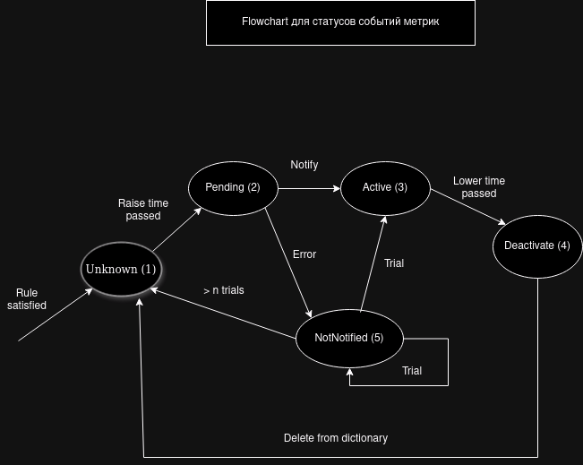
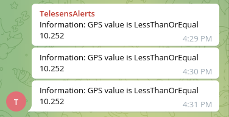

# TrackSense.API.AlertService

<h1>
Сервис для обработки и рассылки оповещений
</h1>

На данный момент реализовано:
<h2>AlertService</h2>
<p>Осуществляется:</p>
<ul>
    <li>API для CRUD-операций по всем сущностям БД</li>
    <li>Автоматическое получение метрик с Kafka и их анализ</li>
    <li>Создание оповещений исходя из полученных метрик</li>
    
    <li>Подгрузка тг каналов из бд</li>
    <li>Рассылка оповещений по указанному интервалу (appsettings.json)</li>
    
</ul>
<h2>Замечания</h2>
<p>В Ubuntu начиная с версии 18.04 стандартный днс файл содержит неправильный dns конфиг</p>
<p>Чтобы исправить:</p>
<code>sudo ln -sf /run/systemd/resolve/resolv.conf /etc/resolv.conf</code></br>
<code>cat /etc/resolv.conf</code>

## Как развернуть у себя
1. Перейдите в корень репозитория.
2. Соберите образы из общего docker-compose файла

    ```bash
    docker-compose -f bootstrap/compose.yaml build --no-cache
    ```

3. Запустите общий docker-compose файл

   ```bash
    docker-compose -f bootstrap/compose.yaml up -d
    ```
4. Доступ к API будет по `localhost:25565`. [Swagger](http://localhost:5015/docs/swagger) 

    
